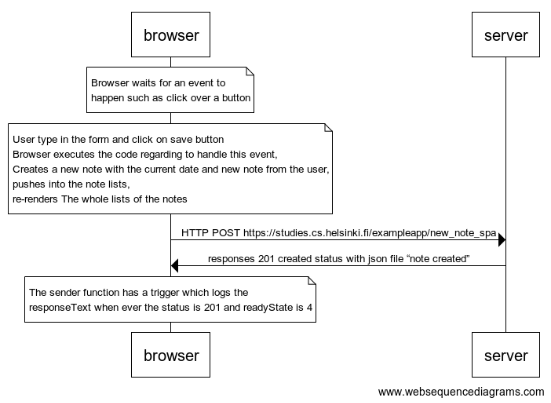

# 0.6: new note spa
```
Note over browser:
Browser waits for an event to 
happen such as click over a button
End note
Note over browser:
User type in the form and click on save button
Browser executes the code regarding to handle this event,
Creates a new note with the current date and new note from the user, 
pushes into the note lists,
re-renders The whole lists of the notes
End note
browser->server: HTTP POST https://studies.cs.helsinki.fi/exampleapp/new_note_spa
server->browser: responses 201 created status with json file “note created”
Note over  browser:
The sender function has a trigger which logs the 
responseText when ever the status is 201 and readyState is 4
End note
```

